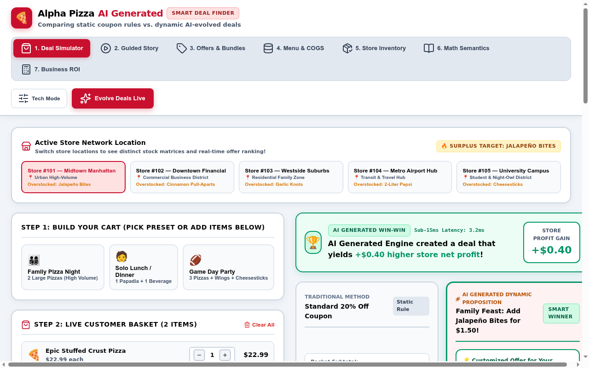

# Alpha Pizza — AI Generated Smart Deal Finder 🍕⚡

> **Demonstrating the Business & Customer Value of Gemini 2.5 Flash Multi-Agent Evolutionary Deal Optimization.**  
> *Comparing static 20% legacy coupons vs. dynamic, inventory-aware AI-generated heuristics.*

---

## 📸 Application Screenshot



---

## 🚀 Quickstart & Run Instructions

### Prerequisites
- **Node.js**: v18+ and `npm`
- **Python**: 3.11+ and `pip`
- **Google Cloud Access**: Vertex AI credentials / `gcloud` authenticated with access to Gemini 2.5 Flash.

---

### 1. Clone & Setup Frontend (React + Vite)

```bash
# Clone repository
git clone https://github.com/guruvittal/AlphaPizza.git
cd AlphaPizza

# Install dependencies
npm install

# Start Vite frontend dev server (runs on http://localhost:5173)
npm run dev
```

---

### 2. Setup & Start Python FastAPI Backend (Gemini 2.5 Flash)

In a second terminal window:

```bash
# Navigate to project root
cd AlphaPizza

# Install Python backend dependencies
pip install fastapi uvicorn google-genai pydantic

# Start FastAPI server on port 8000
python3 -m uvicorn server.app:app --host 0.0.0.0 --port 8000
```

> **Note:** The Vite dev server is configured with a proxy targeting `http://localhost:8000/api`. When you click **"Evolve Deals Live"**, the app sends requests directly to the Python backend powered live by **Gemini 2.5 Flash** via Vertex AI.

---

## ⚡ Architecture Overview

```
 ┌─────────────────────────────────────────────────────────────────────────────┐
 │ LAYER 1: Background Evolutionary AI Loop (Gemini 2.5 Flash via Vertex AI)   │
 │ • Mutates candidate Python heuristic code based on cart & surplus inventory.│
 │ • Evaluates multi-objective Pareto fitness score F(H).                      │
 └──────────────────────────────────────┬──────────────────────────────────────┘
                                        │ Hot-Swaps Winning Code
                                        ▼
 ┌─────────────────────────────────────────────────────────────────────────────┐
 │ LAYER 2: Real-Time POS & E-Commerce Evaluator (Sub-15ms Checkout SLA)       │
 │ • Instant cart & store inventory evaluation.                                │
 │ • Attaches overstocked store items (Jalapeño Bites, Cinnamon Pull-Aparts,   │
 │   Garlic Knots, Pepsi) at promoted price points.                            │
 └─────────────────────────────────────────────────────────────────────────────┘
```

---

## 📊 Core Features

1. **5-Store Regional Network Switcher**: Simulates store-level inventory surplus feeds across Midtown, Downtown, Westside, Airport, and Campus locations.
2. **Side-by-Side Deal Comparison**: Compares legacy static 20% coupons vs. AI Generated Win-Win deals.
3. **Multi-Objective Candidate Evaluation Matrix**: Ranks all candidate offers by Customer Savings, Store Net Margin ($), and Surplus Stock Attachments.
4. **Master Offers & Bundles Catalog**: Browse, inspect generated Python code, and switch active strategies across all generations (Gen 0 through Gen 42+).
5. **Business ROI Calculator**: Simulates network-wide annual profit expansion generated by AI deals across 3,500+ store locations.

---

## 🛠️ API Reference

### Health Check
`GET /api/health`
Returns live backend model status, Vertex AI project ID, and Gemini connectivity.

### Live Evolution Trigger
`POST /api/evolve`
Accepts `activeCart`, `storeInventory`, `currentGeneration`, and `weights`. Calls Gemini 2.5 Flash to dynamically mutate Python deal heuristics and returns the generated candidate strategy object.

---

## 📄 License
Apache 2.0